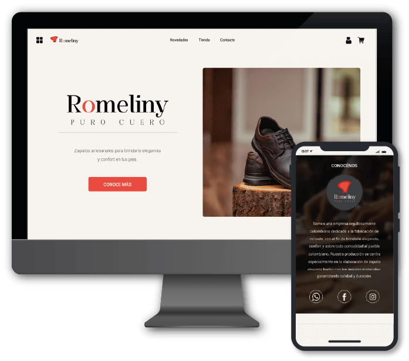

    

# Sitio web de Romeliny

Este proyecto es un sitio web de eCommerce desarrollado con tecnologías modernas. El cliente está construido en `React` utilizando SASS y Bootstrap para estilos y componentes. El servidor backend está basado en `Node.js` y utiliza el módulo Express para implementar una `API RESTful` construyendo los verbos CRUD.

### ¿A qué se dedica la empresa?

Son una empresa orgullosamente colombiana dedicada a la fabricación de calzado, con el fin de brindar elegancia, confort y sobre todo comodidad al pueblo colombiano. Su producción se centra especialmente en la elaboración de zapato elegante hecho con los mejores materiales, garantizando calidad y duración.

### Mapa de navegación

| [Estructura del sitio web](#Estructura) | [ Detalles técnicos](#DetallesTecnicos) | [Front end](#Frontend) | [Back end](#contacto) |
| --------------------------------------- | --------------------------------------- | ---------------------- | --------------------- |

## Características principales

-   Interfaz de usuario en React para una experiencia de navegación fluida y responsive.
-   Estilos personalizados con SASS y componentes de Bootstrap para un diseño atractivo.
-   Efoques de diseño con mobile first y atomic desing, para un desarrollo más limpio y organizado.
-   API RESTful implementada con Express para la comunicación entre el cliente y el servidor.
-   Funcionalidades diferenciadas para usuarios y administradores.

## Tecnoloías usadas

-   `React Js`
-   `Sass`
-   `Bootstrap`
-   `Node Js`
-   `Express Js`
-   `Mongo DB`

## Equipo de trabajo

| Rol                | Nombre                           | Contacto                                                                                |
| ------------------ | -------------------------------- | --------------------------------------------------------------------------------------- |
| Desarrollador web  | Jeisson Alexander Gavilán Murcia | [Linkedin](https://www.linkedin.com/in/jeisson-alexander/)                              |
| Diseñadora gráfica | Angie Liliana Camargo Hernandez  | [Linkedin](https://www.linkedin.com/in/angie-liliana-camargo-hern%C3%A1ndez-0b5072221/) |

<h1 id="Estructura">Estructura del sitio web</h1>

El mapa del sitio muestra la estructura general del sitio web y los diferentes enlaces que los usuarios pueden explorar. Cada sección del mapa del sitio corresponde a una página o grupo de páginas relacionadas.

`Nota:` Solo hay un administrador. Los roles de acceso están indicados entre paréntesis después de cada ruta.

#### Todos los roles

    -   Inicio
    -   Contacto
    -   Acerca de
    -   Registro
    -   Tienda
        -   Banners promosionales
        -   Categoría Casual
        -   Categoría Formal
        -   Categoría Sport

#### Usuario

    -   Usuario
        -   Carrito
        -   Configuración de usuario

#### Administrador

    -   Dashboard
        -   Productos
        -   Usuarios
        -   Carritos
        -   Actualizar Datos
        -   Envío Masivo de Correos
        -   Cambiar Banners

<h1 id="DetallesTecnicos">Detalles Técnicos</h1>

Este proyecto combina diversas tecnologías y enfoques para crear un sitio web funcional, eficiente y atractivo. Los detalles técnicos presentados a lo largo de este documento brindarán una comprensión más profunda de la arquitectura y el enfoque utilizado, sentando las bases para un desarrollo exitoso del proyecto.

### Información general

| Propiedad                 | Valor                                                              |
| ------------------------- | ------------------------------------------------------------------ |
| URL Sitio web             | [Romeliny deploy](https://www.romeliny.com/)                       |
| URL Repositorio Front End | [Romeliny Front End](https://github.com/Alexander206/Romeliny-web) |
| URL Repositorio Back End  | [Romeliny Back End](https://github.com/Alexander206/Romeliny-web)  |
| Version de Node           | 18.16.0                                                            |
| Version de React          | 18.2.0                                                             |
| Version de Vite           | 4.2.0                                                              |

<h1 id="Frontend">Front end</h1>

Es la parte visible y accesible de una aplicación web, es la cara con la que los usuarios interactúan directamente. Se encarga de presentar la información de manera atractiva y funcional, permitiendo una experiencia de usuario fluida y agradable.

    

El proyecto fue desplegado en Netlify, una plataforma de alojamiento y despliegue de aplicaciones web. Netlify ofrece un proceso sencillo y eficiente para publicar aplicaciones frontend, nos interesó por la integración con repositorios Git y un despliegue continuo sin interrupciones.

Para habilitar el enrutameinto de `React router dom` en el proyecto desplegado en Netlify, es necesario agregar un archivo llamado "\_redirects" en la raíz del proyecto. Este archivo permite configurar redirecciones y reescrituras de URL, lo que es útil para manejar rutas personalizadas, redireccionamientos internos y otras configuraciones relacionadas con la navegación del sitio.

#### Configuración del archivo "\_redirects"

        /* /index.html 200

## Estructura del proyecto

El proyecto del sitio web sigue una estructura organizada y modular, lo cual facilita la navegación y el mantenimiento del código. A continuación, se presenta una descripción de la estructura de directorios y archivos principales:

#### Directorio de archivos públicos

    ├── public/
    │ ├── index.html --> Página principal
    │ ├── romeliny.ico --> Icono del sitio
    │ ├── _redirects --> Archivo de configuración netlify
    │ ├── robots.txt
    │ └── sitemap.xml

#### Directorio de código fuente

    ├── src/
    │ ├── components/ --> Componentes reutilizables
    │ │ ├── Header.jsx --> Componente del encabezado
    │ │ ├── Footer.jsx --> Componente del pie de página
    │ │ └── ... --> Otros componentes
    │ │
    │ ├── pages/ --> Páginas del sitio
    │ │ ├── Home.jsx --> Página de inicio
    │ │ ├── Store.jsx --> Página de la tienda
    │ │ ├── Contact.jsx --> Página de contacto
    │ │ └── ... --> Otras páginas
    │ │
    │ ├── styles/ --> Estilos y hojas de estilo
    │ │ ├── global.scss --> Estilos principales
    │ │ ├── components/ --> Estilos de componentes
    │ │ └── ... --> Otros estilos
    │ │
    │ ├── assets/ --> Utilidades y recursos gráficos
    │ │ ├── fonts/ --> Carpeta para fuentes
    │ │ ├── iconos/ --> Carpeta de iconos
    │ │ └── ... --> Otros recursos gráficos
    │ │
    │ ├── App.jsx --> Componente principal de la aplicación
    │ └── index.jsx --> Punto de entrada de la aplicación

#### Directorio raiz del proyecto

    ├── .gitignore --> Archivo de configuración de gitignore
    ├── package.json --> Archivo de configuración de dependencias y scripts
    ├── README.md --> Documentación del proyecto
    └── ...

### Scripts principales

Comandos configurados en el archivo "package.json" del proyecto. Estos scripts nos permiten automatizar tareas comunes durante el desarrollo y despliegue de la aplicación.

-   Ejecuta el servidor de desarrollo utilizando Vite:

          npm run dev

-   Construye la versión de producción del proyecto utilizando Vite:

          npm run build

-   Previsualiza la versión de producción del proyecto utilizando Vite:

          npm run preview

-   Realiza una construcción previa antes de implementar el proyecto:

          npm run predeploy

-   Implementa el proyecto utilizando la herramienta gh-pages:

          npm run deploy

### Bibliotecas principales

-   `React-Router-DOM: ` se utiliza para gestionar las rutas en el cliente, permitiendo una navegación eficiente y dinámica.

-   `React-Bootstrap:` se utiliza para aprovechar los componentes predefinidos y el diseño responsivo proporcionado por Bootstrap 5.

-   `El preprocesador de Sass:` se utiliza para escribir estilos CSS más eficientemente, aprovechando características como variables, anidamiento y mixins.

-   `Vite como el servidor de desarrollo y compilador:`El proyecto utiliza vite, permitiendo una experiencia de desarrollo rápida y optimizada.

-   `La integración de ESLint:` garantiza que el código JavaScript esté escrito de acuerdo con las mejores prácticas y estándares de calidad.

<h1 id="contacto">Back end</h1>

Es un servidor web de un eCommerce basado en Node.js y el módulo de Express. Este proyecto implementa una interfaz backend API con la arquitectura de software RESTful . Se maneja 2 rutas diferentes: `'/productos'` y `'/carrito'`, ademas cuenta con funcionalidades diferentes para usuarios y administradores

---

La variable se encuentra en `./routers/productos.js` y se llama admin, esta por defecto en `true` y tiene habilitada las funcionalidades de administrador en el servidor.

COPYRIGHT © 2022 ROMELINY - TODOS LOS DERECHOS RESERVADOS
